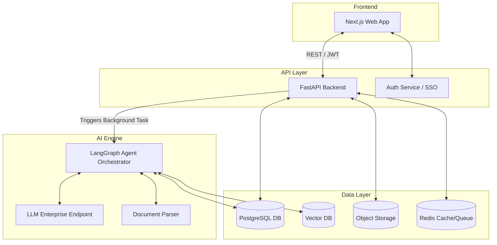

# Solution Design: RFP Response Agent

## Architecture Overview

The system uses a modern, serverless-friendly microservices architecture, heavily utilizing Python for the AI backend and Next.js for the frontend.

### Frontend
- **Framework:** Next.js (React)
- **Styling:** Tailwind CSS + Shadcn UI
- **State Management:** React Query
- **Role:** Provides the dashboard for uploading RFPs, reviewing AI-generated answers, assigning SMEs, and managing the knowledge base.

### Backend (API & Agent Services)
- **Framework:** FastAPI (Python)
- **Role:** Handles document parsing, API routing, authentication, and orchestrates the AI Agent.
- **Agent Orchestration:** LangChain / LangGraph (for multi-step reasoning and state management).

### Database
- **Primary Relational DB:** PostgreSQL (managed, e.g., Supabase or Cloud SQL). Stores users, organizations, RFP metadata, question/answer state, and audit logs.
- **Vector Database:** Pinecone or Qdrant. Stores embeddings of the knowledge base (past proposals, security docs) for semantic search.

### AI & LLM Integration
- **LLM Provider:** OpenAI (GPT-4o) or Google Gemini 1.5 Pro via enterprise API (zero data retention for training).
- **Embedding Model:** OpenAI `text-embedding-3-large` or Voyage AI.

### External APIs & Integrations
- **Document Parsing:** Unstructured.io or LlamaParse for complex PDFs and Word docs.

### Core Infrastructure
- **Authentication:** Auth0 or Supabase Auth (JWT-based, supporting SSO).
- **Storage:** Amazon S3 / Google Cloud Storage for storing uploaded RFPs and knowledge base source files.
- **Queues/Workers:** Redis + Celery (or BullMQ) for background processing of large RFPs (parsing and batch generating answers).
- **Caching:** Redis for caching frequent RAG queries or session state.

## Architecture Diagrams

## Security & Secrets Management
- **Secrets:** Managed via AWS Secrets Manager or GCP Secret Manager.
- **Logging:** Structured JSON logs sent to Datadog or ELK stack.
- **Rate Limiting:** Implemented at the API Gateway / FastAPI middleware using Redis.
